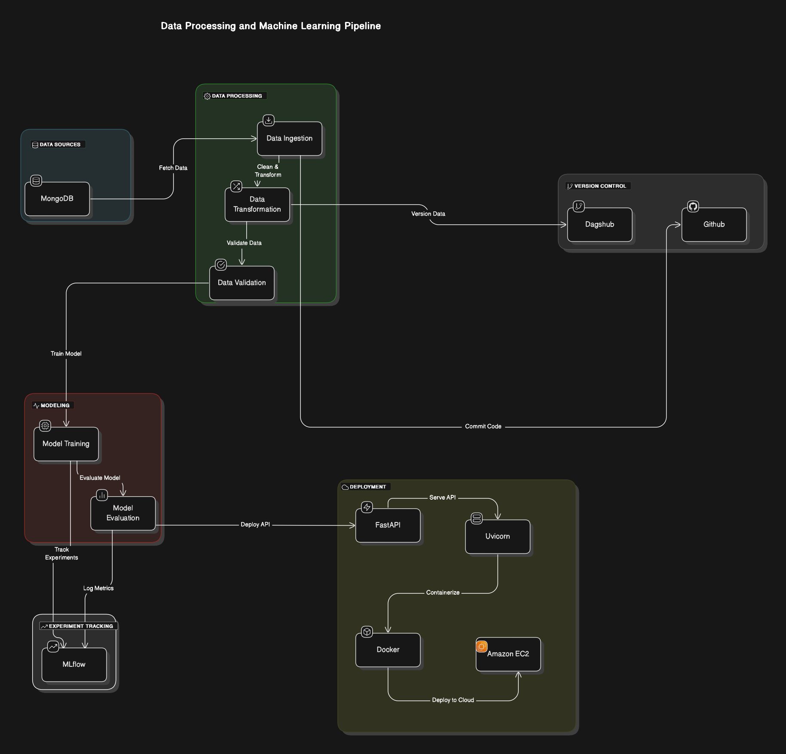

# Phishing Website Detection

This repository contains an end-to-end solution for classifying websites as legitimate or potentially malicious. It demonstrates expertise in scalable data handling, modularized coding practices, and robust machine learning pipelines. The project includes fully automated ETL, model training, evaluation, deployment, and experiment tracking, showcasing advanced skills in data engineering and MLOps.

---

## Project Highlights

### Modularized Coding
- Each stage of the process is independently modularized for scalability, maintainability, and clarity.
- Components include: 
  - **Data Ingestion**
  - **Data Validation**
  - **Data Transformation**
  - **Model Training**
  - **Model Evaluation**

### ETL Pipeline
- Automates data ingestion, preprocessing, and transformation.
- Ensures high data quality and consistent processing.

### CI/CD Pipeline
- Implemented **GitHub Actions** for continuous integration and delivery.
- Automates testing, building, and deployment processes to streamline development and improve reliability.

### API Development
- Built with **FastAPI** and served using **Uvicorn**, enabling efficient and asynchronous request handling for real-time classification.

---

## The Project Structure :
  
  

## Technical Stack

### Data Storage
- **MongoDB**: Scalable storage and retrieval of large datasets.

### Experiment Tracking
- **DagsHub** and **MLflow**: Track all model experiments, including hyperparameter tuning and model metrics.

### Model Storage and Deployment
- **S3 Bucket**: Stores best-performing models and preprocessing artifacts.
- **Docker** & **Amazon ECR**: Application encapsulated in Docker, stored in ECR.
- **Amazon EC2**: Deployment of the Docker container for scalable inference.

### Framework and Server
- **FastAPI**: High-performance framework for asynchronous applications.
- **Uvicorn**: Lightweight ASGI server for deployment.

---

## Project Workflow

### 1. Data Ingestion
- Data is ingested from **MongoDB**, ensuring reliability and scalability.

### 2. Data Validation
- Ensures data quality before entering the processing pipeline.

### 3. Data Transformation
- Feature engineering, scaling, and encoding applied to prepare data for modeling.

### 4. Model Training and Evaluation
- **Machine Learning Models**:
  - Logistic Regression
  - Decision Tree
  - Random Forest
  - AdaBoost
  - Gradient Boosting
- **Evaluation Metrics**:
  - Accuracy
  - Precision
  - Recall
  - F1-Score
- Best-performing models and preprocessing artifacts are saved for deployment.

### 5. Experiment Tracking
- All experiments documented with DagsHub and MLflow, including:
  - Hyperparameter choices
  - Model performance
  - Artifacts for future iterations

### 6. Deployment
- Model and preprocessor stored in **S3**.
- Docker image stored in **ECR**.
- Deployed on **Amazon EC2** for real-time classification.

---

## Setup and Deployment

### AWS Configuration
Add the following secrets to your GitHub repository:

```plaintext
AWS_ACCESS_KEY_ID="Your Access Key"
AWS_SECRET_ACCESS_KEY="Your Secret Key"
AWS_REGION="Your Default Region"
AWS_ECR_LOGIN_URI="Your ECR Login URI"
ECR_REPOSITORY_NAME="Your ECR Repository Name"
```

### Docker Setup in EC2
Run these commands in the EC2 terminal to prepare the instance:

```bash
sudo apt-get update -y
sudo apt-get upgrade -y
curl -fsSL https://get.docker.com -o get-docker.sh
sudo sh get-docker.sh
sudo usermod -aG docker ubuntu
newgrp docker
```

---

## Installation

### Clone the Repository
```bash
git clone https://github.com/Nikhiliitg/networksecurity.git
cd networksecurity
```

### Install Dependencies
```bash
pip install -r requirements.txt
```

### Environment Variables
Set up a `.env` file with the following variables:

```plaintext
# MongoDB Credentials
MONGO_URI="Your MongoDB URI"

# AWS Keys
AWS_ACCESS_KEY_ID="Your Access Key"
AWS_SECRET_ACCESS_KEY="Your Secret Key"

# DagsHub and MLflow
DAGSHUB_URI="Your DagsHub URI"
MLFLOW_TRACKING_URI="Your MLflow Tracking URI"
```

---

## Running the Project

### Run the Pipeline
```bash
python3 main.py
```

### Run the FastAPI Application
```bash
uvicorn app:app --reload
```

---

## Key Accomplishments

- **Modular and Scalable Design**: Flexible and easily extendable pipeline.
- **Fully Automated CI/CD Pipeline**: Ensures quick and reliable integration and deployment.
- **Advanced Experiment Tracking**: Comprehensive experiment logging with DagsHub and MLflow.

---

## License
This project is licensed under the MIT License. See the LICENSE file for details.

---

## Contact
For any inquiries or collaboration opportunities, please contact:

**Nikhil**

GitHub: [Nikhiliitg](https://github.com/Nikhiliitg)
